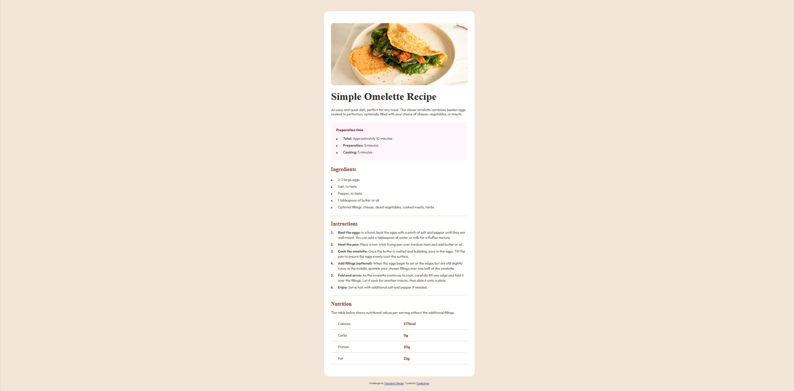
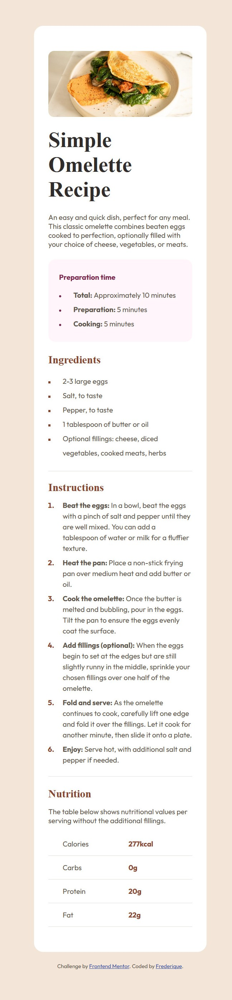

 🎯 Frontend Mentor - Défi "Recipe Page"

Bienvenue sur mon projet basé sur le challenge "Recipe page" de Frontend Mentor.  
Il s'agissait de reproduire fidèlement une fiche de recette en HTML et CSS en respectant les consignes précises de design (mobile et desktop).  
Ce projet m’a permis de consolider mes bases en HTML/CSS, d’utiliser des listes personnalisées et de rendre une page responsive sans media queries.

 🖼️ Aperçu

Voici un aperçu du résultat final :  
  

 🚀 Le défi

- Reproduire à l’identique la maquette fournie
- Utiliser HTML pour structurer la page
- Créer des listes avec des puces personnalisées (avant chaque ingrédient)
- Colorer uniquement les numéros de liste (instructions) avec "::marker"
- Styliser un tableau HTML pour l'affichage des valeurs nutritionnelles
- Centrer et adapter l'affichage à toutes les tailles d’écran

 🔗 Liens utiles

- 💻 Code source : [Voir sur GitHub](https://github.com/oxford777/Recipe_page)
- 🌍 Site en ligne : [Voir le site en direct](https://oxford777.github.io/Recipe_page/)

## 🛠️ Outils que j’ai utilisés

Pour construire cette page, je me suis appuyée sur :

- HTML5 pour une structure claire et accessible
- CSS3 avec un peu de Flexbox pour centrer le contenu facilement
- Des petits ajustements avec ::before et ::marker pour personnaliser les puces et les  numéros
- La propriété border-collapse pour avoir un tableau propre et bien aligné
- Des couleurs en hsl() pour respecter le design et garder une harmonie visuelle
- Et surtout, un design responsive naturel : pas besoin de media queries dans ce cas, j’ai utilisé des unités comme %, rem ou auto qui s’adaptent toutes seules à la taille de l’écran

 📚 Ce que j’ai appris

- Comment styliser une liste avec une petite puce rose personnalisée (::before)
- Comment cibler uniquement les numéros d’une liste ordonnée avec "::marker"
- Pourquoi "border-collapse: collapse" est important pour un tableau sans double bordure
- Comment mettre en gras uniquement les chiffres, sans toucher au texte autour
- Comment centrer proprement une carte avec Flexbox
- Et enfin, comment utiliser des unités comme vw pour rendre les tailles dynamique et souples

 🔄 À améliorer plus tard

- Être plus à l’aise avec les unités comme vw, clamp() et les utiliser plus naturellement
- M’assurer que la page ne déborde pas sur certains écrans (éviter le scroll vertical inutile) 
- Choisir des pseudo-éléments compatibles avec tous les navigateurs (par exemple éviter ::marker qui ne fonctionne pas toujours bien sur Safari)

 📚 Ressources utiles

- [MDN - ::marker](https://developer.mozilla.org/fr/docs/Web/CSS/::marker)
- [MDN - ::before](https://developer.mozilla.org/fr/docs/Web/CSS/::before)
- [CSS Tricks - border-collapse](https://css-tricks.com/almanac/properties/b/border-collapse/)

 👩‍💻 À propos de moi

Je m'appelle Frédérique et je continue à me former en développement web.  
Ce projet m’a permis de progresser sur des détails visuels importants et de gagner en précision.

- GitHub : [@oxford777](https://github.com/oxford777)
- Frontend Mentor : [@oxford777](https://www.frontendmentor.io/profile/oxford777)

 🙏 Merci !

Merci à Frontend Mentor pour ce challenge très bien conçu.  
Ce genre d’exercice m’aide vraiment à progresser : je prends confiance petit à petit, je fais plus attention aux détails, et je comprends mieux les bonnes pratiques front-end.
